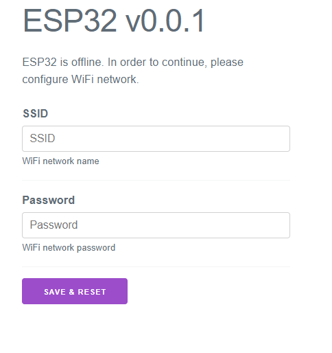

# Essentials for ESP32
C++17 ESP-IDF component with boilerplate for WiFi, MQTT, configuration, persitent storage and device info.

# How to use
1. Add this repo as a submodule into `components` folder:
```bash
cd my-esp-idf-project/
git submodule add https://github.com/lubosmato/esp32-essentials.git components/essentials/
```
```
my-esp-idf-project/
├── components/
│   ├── essentials/ <--
│   └── ...another components...
├── main/
│   ├── CMakeLists.txt
│   └── main.cpp
├── CMakeLists.txt
├── sdkconfig
└── partitions.csv
```
2. Add binary data of web settings app and C++20 support into root `CMakeLists.txt`:
```cmake
cmake_minimum_required(VERSION 3.5)

set(CMAKE_CXX_STANDARD 20) # <--

include($ENV{IDF_PATH}/tools/cmake/project.cmake)
project(my-esp-idf-project)

target_add_binary_data(${CMAKE_PROJECT_NAME}.elf "components/essentials/resources/web/dist/app.js.gz" TEXT) # <--
target_add_binary_data(${CMAKE_PROJECT_NAME}.elf "components/essentials/resources/web/dist/index.html.gz" TEXT) # <--
```
3. Enable exceptions in `idf.py menuconfig`
4. Add `REQUIRES` into your main `CMakeLists.txt`:
```
idf_component_register(
    SRCS "main.cpp"
    REQUIRES essentials
)
```
5. (optional) Configure AP WiFi settings (ssid, password, channel) with `idf.py menuconfig`
6. Build

# Examples

## Device info
Provides access to device internal information such as free/used heap, unique ID, ...

Example:
```cpp
#include "essentials/esp32_device_info.hpp"

namespace es = essentials;

es::Esp32DeviceInfo deviceInfo{};
printf("Unique id: %s\n", deviceInfo.uniqueId().c_str());
printf("Free heap: %d\n", deviceInfo.freeHeap());
printf("Used heap: %d\n", deviceInfo.usedHeap());
```

## Storage
Storage which uses NVS.

Example:
```cpp
#include "essentials/esp32_storage.hpp"

namespace es = essentials;

// Esp32Storage uses nvs to store data
es::Esp32Storage storage{"storageKey"};
storage.clear();

std::vector<uint8_t> data = storage.read("mac", 6); // read 6-byte value from storage with key 'mac' 
if (data.empty()) {
  data.resize(6);
  for (uint8_t& b : data)
    b = uint8_t(esp_random());
  storage.write("mac", es::Range<uint8_t>{data.data(), data.size()});
}
for (uint8_t& b : data)
  printf("%02x ", b);
printf("\n");
```

## Config
Provides convenient way for storing/loading configuration values. Uses `essentials::PersistentStorage`.

Example:
```cpp
#include "essentials/esp32_storage.hpp"
#include "essentials/config.hpp"

namespace es = essentials;

es::Esp32Storage configStorage{"config"};
es::Config config{configStorage};

auto ssidConfig = config.get<std::string>("ssid");
auto integerConfig = config.get<int>("integer");

// operator* loads value from storage and returns it
if (ssidConfig->empty()) {
  ssidConfig = "New SSID"; // operator= saves to storage
}

printf("Old SSID is %s\n", ssidConfig->c_str()); // load from storage
ssidConfig = *ssidConfig + "."; // save to storage
printf("New SSID is %s\n", ssidConfig->c_str()); // load from storage again

printf("Integer is %d\n", *integerConfig); // load from storage
int integer = integerConfig; // operator T() can also be used for loading from storage
// calculate stuff with integer
integer++;
// end of calculation
integerConfig = integer; // save to storage
```

## WiFi
WiFi is managed by RAII class which tries to connect to the WiFi based on given credentials. 

If connection is not possible, it automatically switches to `AP` mode and runs web server with settings web interface. New settings are stored into the storage with use of `essentials::Config` values. Settings can be adjusted on `http://192.168.4.1/`: 



Example:
```cpp
#include "essentials/esp32_storage.hpp"
#include "essentials/config.hpp"
#include "essentials/wifi.hpp"

namespace es = essentials;
// ...
es::Esp32Storage configStorage{"config"};
es::Config config{configStorage};

auto ssid = config.get<std::string>("ssid");
auto wifiPass = config.get<std::string>("wifiPass");
es::Wifi wifi{ssid, wifiPass}; // blocking call, waiting for connection
```

## MQTT
```cpp
#include "freertos/FreeRTOS.h"
#include "freertos/task.h"

#include "essentials/wifi.hpp"
#include "essentials/mqtt.hpp"
#include "essentials/esp32_storage.hpp"
#include "essentials/esp32_device_info.hpp"
#include "essentials/config.hpp"

namespace es = essentials;

// don't forget to link root certificate in root CMakeLists.txt:
// target_add_binary_data(${CMAKE_PROJECT_NAME}.elf "main/cert.pem" TEXT)
// see how to generate certificate below in Details section
extern const uint8_t mqttCertBegin[] asm("_binary_cert_pem_start");
extern const uint8_t mqttCertEnd[] asm("_binary_cert_pem_end");

es::Esp32DeviceInfo deviceInfo{};

void exampleApp() {
  es::Esp32Storage configStorage{"config"};
  es::Config config{configStorage};

  auto ssid = config.get<std::string>("ssid");
  auto wifiPass = config.get<std::string>("wifiPass");
  es::Wifi wifi{ssid, wifiPass};

  std::string mqttPrefix = "esp32/" + deviceInfo.uniqueId();
  es::Mqtt::ConnectionInfo mqttInfo{
    "mqtts://my.mqtt.com:8883",
    std::string_view{
      reinterpret_cast<const char*>(mqttCertBegin),
      std::size_t(mqttCertEnd - mqttCertBegin)
    },
    "username",
    "password"
  };
  es::Mqtt mqtt{mqttInfo, mqttPrefix};

  // task which publishes device info every second
  xTaskCreate(
    +[](void* arg) {
      es::Mqtt& mqtt = *reinterpret_cast<es::Mqtt*>(arg);
      while (true) {
        mqtt.publish("info/freeHeap", deviceInfo.freeHeap(), es::Mqtt::Qos::Qos0, false);
        mqtt.publish("info/usedHeap", deviceInfo.usedHeap(), es::Mqtt::Qos::Qos0, false);
        vTaskDelay(1000 / portTICK_PERIOD_MS);
      }
    },
    "device_info",
    4 * 1024,
    &mqtt,
    configMAX_PRIORITIES,
    nullptr
  );

  std::vector<std::unique_ptr<es::Mqtt::Subscription>> subs;

  subs.emplace_back(
    mqtt.subscribe("ping", es::Mqtt::Qos::Qos0, [&mqtt](std::string_view data) {
      std::string text = std::string(data);
      printf("got ping: %s\n", text.c_str());
      mqtt.publish("pong", "Pinging back :)", es::Mqtt::Qos::Qos0, false);
    })
  );

  subs.emplace_back(
    // lambda subscription
    mqtt.subscribe<int>("number", es::Mqtt::Qos::Qos0, [&mqtt](std::optional<int> value) {
      if (value) {
        printf("got number value: %d\n", *value);
      }
    })
  );
  
  int myValue = 0;
  subs.emplace_back(
    // value subscription
    mqtt.subscribe("number", es::Mqtt::Qos::Qos0, myValue)
  );

  std::string myText{};
  subs.emplace_back(
    // multiple subscriptions to same topic 'number'
    mqtt.subscribe("number", es::Mqtt::Qos::Qos0, myText)
  );

  int seconds = 0;
  while (true) {
    printf("myValue: %d\n", myValue);
    printf("myText: %s\n", myText.c_str());

    if (seconds % 10 == 0) {
      mqtt.publish("test/string", "how are you?", es::Mqtt::Qos::Qos0, false);
      mqtt.publish("test/integer", 42, es::Mqtt::Qos::Qos0, false);
      mqtt.publish("test/double", 42.4242, es::Mqtt::Qos::Qos0, false);
      mqtt.publish("test/bool", true, es::Mqtt::Qos::Qos0, false);
    }

    vTaskDelay(1000 / portTICK_PERIOD_MS);
    ++seconds;
  }
}

extern "C"
void app_main()
{
  try {
    exampleApp();
  } catch (const std::exception& e) {
    printf("EXCEPTION: %s\n", e.what());
  } catch (...) {
    printf("UNKNOWN EXCEPTION\n");
  }
  vTaskDelay(5000 / portTICK_PERIOD_MS);
  esp_restart();
}
```

## Details
- Good app (can visualize values in charts) for testing MQTT: http://mqtt-explorer.com/

- Binary which uses WiFi and MQTT has approximately 1MB thus you might need to adjust main partition size in `partitions.csv`:
    ```
    # ESP-IDF Partition Table
    # Name,   Type, SubType, Offset,  Size, Flags
    nvs,      data, nvs,     0x9000,  0x6000,
    phy_init, data, phy,     0xf000,  0x1000,
    factory,  app,  factory, 0x10000, 2M, # <--
    ```

- Library uses exceptions and C++20 features thus you must enable them

- Root certificate can be obtained with: 
    ```bash
    echo "" | openssl s_client -showcerts -connect my.mqtt.com:8883 | sed -n "1,/Root/d; /BEGIN/,/END/p" | openssl x509 -outform PEM > cert.pem
    ```
    Replace `my.mqtt.com:8883` with MQTT broker's address.
    
    To use certificate edit your root `CMakeLists.txt`:
    ```cmake
    cmake_minimum_required(VERSION 3.5)

    set(CMAKE_CXX_STANDARD 20)

    include($ENV{IDF_PATH}/tools/cmake/project.cmake)
    project(my-esp-idf-project)

    target_add_binary_data(${CMAKE_PROJECT_NAME}.elf "components/essentials/resources/web/dist/app.js.gz" TEXT)
    target_add_binary_data(${CMAKE_PROJECT_NAME}.elf "components/essentials/resources/web/dist/index.html.gz" TEXT)
    
    target_add_binary_data(${CMAKE_PROJECT_NAME}.elf "main/cert.pem" TEXT) # <--
    ```
    And use linked cert data in code:
    ```cpp
    extern const uint8_t mqttCertBegin[] asm("_binary_cert_pem_start");
    extern const uint8_t mqttCertEnd[] asm("_binary_cert_pem_end");
    ```

# TODO
- [ ] MQTT subscription to multi and single level (heavy feature, maybe YAGNI)
- [ ] Check all error codes and throw
- [ ] Make settings web server simpler without enormous number of route handlers
- [ ] Make settings web app smaller (overkilled by Vue.js)
- [ ] Add tests
- [ ] Use `std::to_chars` and `std::from_chars` for floating point types when will be implemented in GCC
