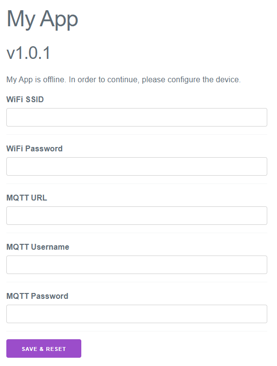

# Essentials for ESP32
MQTT, WiFi, persistent configuration, web server and other useful things for ESP32. Main idea of Essentials is **build your MQTT API** easily:

## MQTT
```cpp
es::Mqtt mqtt{...};
std::vector<std::unique_ptr<es::Mqtt::Subscription>> subscribers;

// value subscription
int myValue = 0;
subscribers.emplace_back(mqtt.subscribe("number", es::Mqtt::Qos::Qos0, myValue));

// multiple subscriptions to same topic 'number'
std::string myText{};
subscribers.emplace_back(mqtt.subscribe("number", es::Mqtt::Qos::Qos0, myText));

// generic publish for string, int, float, double, bool
mqtt.publish("my/topic/int", 42, es::Mqtt::Qos::Qos0, false /*isRetained*/);

// lambda subscription to a generic value type (string, string_view, int, float, double and bool supported)
subscribers.emplace_back(
  mqtt.subscribe<int>("number", es::Mqtt::Qos::Qos0, [](std::optional<int> value) {
    if (value) {
      printf("got number value: %d\n", *value);
    }
  })
);

// lambda subscription with publish
subscribers.emplace_back(
  mqtt.subscribe("ping", es::Mqtt::Qos::Qos0, [&mqtt](std::string_view data) {
    std::string text = std::string{data};
    printf("got ping: %s\n", text.c_str());
    mqtt.publish("pong", "Pinging back :)", es::Mqtt::Qos::Qos0, false);
  })
);

```

## WiFi

```cpp
es::Wifi wifi;

wifi.setConnectCallback([]() { printf("Successfully connected to wifi\n"); });
wifi.setDisconnectCallback([]() { printf("Disconnected from wifi\n"); });

wifi.connect("My SSID", "my password");

vTaskDelay(pdMS_TO_TICKS(5000));

if (!wifi.isConnected()) {
  printf("Couldn't connect to the wifi. Starting WiFi AP.\n");
  wifi.startAccessPoint("esp32", "12345678", es::Wifi::Channel::Channel5);
}

while (true) {
  std::optional<es::Ipv4Address> ip = wifi.ipv4();
  if (ip) {
    printf("IP: %s\n", ip->toString().c_str());
  } else {
    printf("Don't have IP\n");
  }
  vTaskDelay(pdMS_TO_TICKS(5000));
}
```

## Persistent config and web server for basic settings
```cpp
es::Esp32Storage configStorage{"config"};
es::Config config{configStorage};

auto ssid = config.get<std::string>("ssid");
auto wifiPass = config.get<std::string>("wifiPass");
auto myValue = config.get<std::string>("myValue");

es::Esp32Storage mqttStorage{"mqtt"};
es::Config mqttConfig{mqttStorage};
auto mqttUrl = mqttConfig.get<std::string>("url");
auto mqttUser = mqttConfig.get<std::string>("user");
auto mqttPass = mqttConfig.get<std::string>("pass");

es::Wifi wifi;
es::SettingsServer settingsServer{80,
  "My App",
  "1.0.1",
  {
    // fields for web app
    {"WiFi SSID", ssid},
    {"WiFi Password", wifiPass},
    {"MQTT URL", mqttUrl},
    {"MQTT Username", mqttUser},
    {"MQTT Password", mqttPass},
  }};

wifi.startAccessPoint("esp32", "12345678", es::Wifi::Channel::Channel5);

settingsServer.start();
```
`es::SettingsServer` serves web app with custom fields which will be saved into persistent storage:


See more in [examples](examples/).

# How to use

0. Download esp-idf v4.3. There is a handy [extension](https://marketplace.visualstudio.com/items?itemName=espressif.esp-idf-extension) for `VSCode` which installs all stuff you need.

1. Add this repo as a submodule into `components` folder:
    ```bash
    cd my-esp-idf-project/
    git submodule add https://github.com/lubosmato/esp32-essentials.git components/essentials/
    ```
    ```
    my-esp-idf-project/
    ├── components/
    │   ├── essentials/ <--
    │   └── ...another components...
    ├── main/
    │   ├── CMakeLists.txt
    │   └── main.cpp
    ├── CMakeLists.txt
    ├── sdkconfig
    └── partitions.csv
    ```
2. Add binary data of web settings app and C++20 support into root `CMakeLists.txt`:
    ```cmake
    cmake_minimum_required(VERSION 3.5)

    set(CMAKE_CXX_STANDARD 20) # <--

    include($ENV{IDF_PATH}/tools/cmake/project.cmake)
    project(my-esp-idf-project)

    target_add_binary_data(${CMAKE_PROJECT_NAME}.elf "components/essentials/resources/web/dist/app.js.gz" TEXT) # <-- (only needed by `essentials::SettingsServer`)
    target_add_binary_data(${CMAKE_PROJECT_NAME}.elf "components/essentials/resources/web/dist/index.html.gz" TEXT) # <-- (only needed by `essentials::SettingsServer`)
    ```
3. Enable exceptions in `idf.py menuconfig`
4. Add `REQUIRES` into your main `CMakeLists.txt`:
    ```
    idf_component_register(
        SRCS "main.cpp"
        REQUIRES essentials
    )
    ```
5. Build
6. Inspire from [examples](examples/)

[Details](examples/readme.md#Details)

# TODO
- [x] Migrate to esp-idf v4.1
- [x] Fix Esp32Storage::clear() - it mustn't clear all NVS
- [x] Add wait for MQTT connection feature with timeout (similar as Wifi)
- [ ] Add more device info
- [ ] MQTT subscription to multi and single level (heavy feature, maybe YAGNI)
- [ ] Check all error codes and throw
- [x] Make settings web server simpler without enormous number of route handlers
- [x] Make settings web app smaller (overkilled by Vue.js)
- [ ] Add tests
- [ ] Use `std::span` when will be supported by esp-idf toolchain
- [ ] Use `std::to_chars` and `std::from_chars` for floating point types when will be implemented in GCC
- [x] Migrate to esp-idf v4.3
